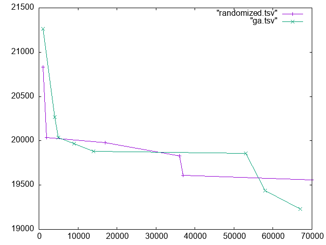

# HW10
Continuation of the traveling salesperson problem

Aliya Ghassaei and Nina Young

CS221 Fall 2021

To optimize our code later, do command F ? to find any questions we have/possible ways to make code better

## Overview

The traveling salesperson problem asks us to find the shorest route that takes us to each city in the given list once and return to the starting location. Since this problem is NP-hard, there is no efficient way to solve it. We are implementing a genetic algorithm approach to appromimate the shortest path.

## Chromosome Class

A chromosome represents a permutation on the orders of the cities to visit. Note that this class does not premit default construction and copying to preserve polymorphism. The only way to create a Chromosome class is via the create() method, and the only way to copy one is via the clone() method. (not sure this this is accurate (?)). This class builds off of the Cities class.

## Deme Class

 A deme is a population of individuals. Deme class will evolve a genetic algorithm for the travelling-salesperson problem

## Running the Code

To compile, type `make` into the commandline then `./tsp`. (I think) the code will print some things???

actually we probably want to have two tsp files one random and one with our genetic alg

## Visualizations

To visualize our results we used `gnuplot`

put the visualizations in a folder called images

**Feedback from last time** Nice graphs, consider adding labels for your axis on the next part of this project! This is especially helpful here since you are
counting down the number of remaining iterations which means that your speed.gif looks like a horizontal flip of what it would be if you had counted up in iterations which confused me at first!
